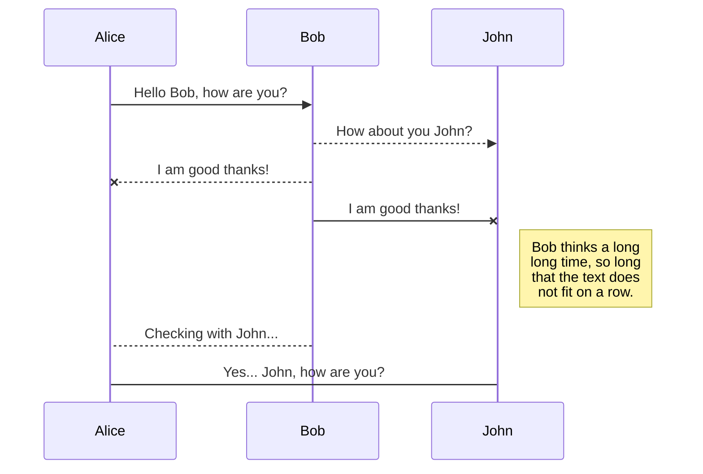
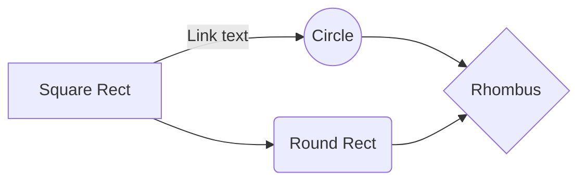

# Setup Guide

This guide will walk you through the process of setting up and deploying the network for the Blockopoly Master Thesis, using the Hyperledger Besu framework.
Before beginning, it is highly recommended to read the Blockopoly Dissertation files provided at the root of the repository. This will give you a solid understanding of how Besu operates, along with a grasp of the basic concepts that will be frequently mentioned throughout this guide.

---

  ## 1. Prerequisites

To deploy the network you will need the following technologies:  
1. **Unix-based Operating system** or [WSL2.0](https://learn.microsoft.com/en-us/windows/wsl/install) if you are using Windows;
2. **Git** - To manage versions and clone the repository; 
3. **Docker** - Ensure [WSL2.0 engine support](https://docs.docker.com/desktop/wsl/) is enabled if using WSL;
4. **Curl** - Check curl documentation [here](https://curl.se/download.html) or run `sudo apt install curl`
5. **Node** - Check ... run `curl -o- https://raw.githubusercontent.com/nvm-sh/nvm/master/install.sh | bash` and `nvm install node`
6. **JDK 17+** - Check ... run `sudo apt install openjdk-17-jdk -y`
7. **Besu Binaries** - Run `wget https://github.com/hyperledger/besu/releases/download/24.3.0/besu-24.3.0.tar.gz` and then `tar -xvf besu-24.3.0.tar.gz`. This will extract the binaries to the current directory.
8. **Tessera Binaries** - Run `wget https://s01.oss.sonatype.org/service/local/repositories/releases/content/net/consensys/quorum/tessera/tessera-dist/24.4.1/tessera-dist-24.4.1.tar` and then `tar -xvf tessera-dist-24.4.1.tar`. This will extract the binaries to the current directory.

Add the following lines to your `.bashrc` or `.bash_profile` file, replacing `yourusername` with your actual username:

```
export NVM_DIR="/home/yourusername/.nvm"
[ -s "$NVM_DIR/nvm.sh" ] && \. "$NVM_DIR/nvm.sh"

export JAVA_HOME=/usr/lib/jvm/java-17-openjdk-amd64
export PATH=$JAVA_HOME/bin:$PATH

export PATH=$PATH:~/besu-24.3.0/bin
export PATH=$PATH:~/tessera-24.4.1/bin
```
  
Afterwards, clone this repository to your working directory. If using WSL, ensure the directory is within the WSL filesystem.
Afterwards, you must install Hyperledger Besu's Binaries. 

Install the following node modules globally (using the `-g` flag) or locally inside the *Blockopoly/besu/src* folder, depending on your preference:
```
npm install hardhat
npm install ethers
```

---

  ## 2. Directory Structure
  
Before proceeding, it is important to familiarize yourself with the repository's directory structure to navigate and understand the setup efficiently.

| Folder         | Content                       |
|----------------|-------------------------------|
|src| The source code for the smart contracts, containing the business logic. Additionally, contains tests and configuration files to deploy them using Hardhat. |
|compose| Docker Compose files to deploy the network nodes. |
|scripts | A collection of scripts to automate the process of deploying the network and the smart contracts. |
|config |Configuration files regarding the consensus algorithm, and initial settings. |

After deploying the network, two additional folders will be created:

| Folder         | Content                       |
|----------------|-------------------------------|
|cryptogen| Contains the cryptographic material for each of the network's nodes. In production environment, all of the contents inside this folder should be present in every single peer. |
|genesis| The genesis block. |

---

  ## 3. Deploying the network
	
Start by opening a terminal at *Blockopoly/besu*. Deploying the network with the preconfigured settings for the proposed work is a seamless process, as all necessary commands are encapsulated within scripts provided in the repository. Before running any script, ensure it is executable by modifying its permissions with the *chmod* command, in this case: `chmod +x script.sh`

Then, booting the network is as simple as running one single command: `./script.sh`

Behind the scenes, this script will generate the cryptographic material for ..., create the genesis block, launch Docker containers for each of the peers and finally ...

(UML diagram)

The default network is composed of ...

---

  ## 4. Organizational stuff ...


  ## 5. Testing the Network

  ```
  npm install --only=prod @hyperledger/caliper-cli@0.6.1
  
  ```


---

  ## 6. Logging and Monitoring (Optional)

At *Blockopoly/besu/scripts* you can find the *logspout.sh* script, which deploys a Logspout container to monitor the logs of the network's containers. This is an optional step, but it can be useful to monitor the network's activity and debug any issues that may arise.

To deploy the Logspout container, **open a new terminal** at *Blockopoly/besu/scripts* and run the following command: `./logspout.sh`

---

<details>

<summary>stuff</summary>

## Ignore the following content, it is just a placeholder for now.

## UML diagrams

You can render UML diagrams using [Mermaid](https://mermaidjs.github.io/). For example, this will produce a sequence diagram:



And this will produce a flow chart:


</details>