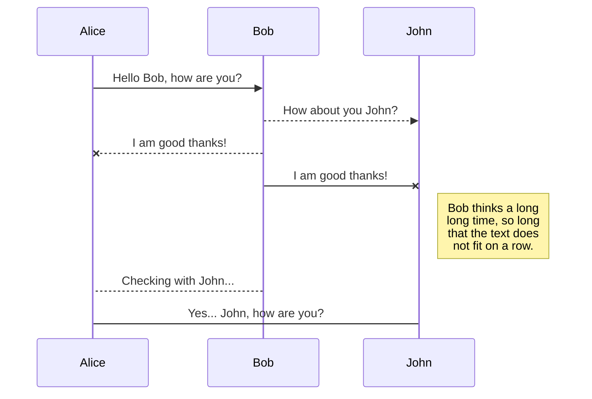
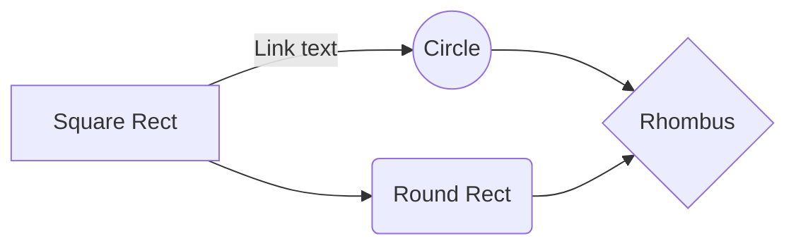

# Setup Guide

This guide will walk you through the process of setting up and deploying the network for the Blockopoly Master Thesis, using the Hyperledger Fabric framework.
Before beginning, it is highly recommended to read the Blockopoly Dissertation files provided at the root of the repository. This will give you a solid understanding of how Fabric operates, along with a grasp of the basic concepts that will be frequently mentioned throughout this guide.

---

  ## 1. Prerequisites

To deploy the network you will need the following technologies:  
1. **Unix-based Operating system** or **WSL2.0** if you are using Windows;
2. **Git** - To manage versions and clone the repository; 
3. **Docker** - Ensure WSL2.0 engine support is enabled if using WSL;
4. **Curl** - Check curl documentation [here](https://curl.se/download.html) or run `sudo apt install curl`
5. **Go Programming Language** - Check Go documentation [here](https://go.dev/dl/) or run:
	  ```
		TODO
		sudo wget https://go.dev/dl/go1.21.6.linux-amd64.tar.gz	
		sudo tar -C ../../usr/local  -xzf  go1.21.6.linux-amd64.tar.gz
		...
	  ```
  
Clone this repository to your working directory. If using WSL, ensure the directory is within the WSL filesystem.
 Afterwards, you must install Hyperledger Fabric's binaries and Docker image. The install script `install-fabric.sh` is included in this directory. Open a new terminal at *Blockopoly/src* and run the following command:
  	  `chmod +x install-fabric.sh && ./install-fabric.sh docker binary`

---

  ## 2. Folder Structure
  
Before proceeding, it is important to familiarize yourself with the repository's structure to navigate and understand the setup efficiently.

| Folder         | Content                       |
|----------------|-------------------------------|
|bin| Hyperledger Fabric binaries |
|chaincode| The source code for the smart contracts, containing the business logic.|
| cli-scripts | A collection of scripts to be run inside a CLI container, that automate the process of creating the channels and deploying the chaincode.|
|config |Configuration files for peers (*core.yaml*), orderers (*orderer.yaml*) and channels (*configtx.yaml*).|
| fabric-ca | Contains the local MSPs for each of the peers, orderers, admins and CAs, including all the private cryptographic materials. In a production environment, these would be securely distributed across different machines and accessible only to the designated entities. |

After deploying the network, two additional folders will be created:

| Folder         | Content                       |
|----------------|-------------------------------|
|channels| Channel configurations and genesis blocks. |
|organizations| The channel MSP, consisting of public cryptographic material for each of the organizations. In production environment, all of the contents inside this folder should be present in every single peer. The content of this folder is only used in *configtx.yaml*. |

---

  ## 3. Deploying the network

Start by opening a terminal at *Blockopoly/src*. The first thing to do is to define the environment variables for the Fabric binaries and configurations. The following commands **must be executed in every new terminal session**, and the specified paths **will vary** based on the location of the Blockopoly repository on your filesystem.
	`
	export PATH=$HOME/go/Blockopoly/src/bin:$PATH 
	export FABRIC_CFG_PATH=$HOME/go/Blockopoly/src/config/ 
	`
	
Deploying the network with the preconfigured settings for the proposed work is a seamless process, as all necessary commands are encapsulated within scripts provided in the repository. Before running any script, ensure it is executable by modifying its permissions with the *chmod* command, in this case: `chmod +x script.sh`

Then, booting the network is as simple as running one single command: `. script.sh boot`

Behind the scenes, this script will use the configuration files to generate the cryptographic material for each organization's Certificate Authorities (CAs), register and enroll the peers, orderers and admins, create the genesis block and channel configurations, and finally launch Docker containers for each of the peers and orderers. A CLI container will also be deployed, to facilitate the next steps. 
In a production environment, the script's commands would require **individual execution** on each network node.

(UML diagram)

The default network is composed of 4 endorsing organizations - the User Registry (UR), the Land Registry (LR), a Governmental Institution (GOV) and a Bank (B1). In the current version, the Ordering Service is comprised of only one ordering node, belonging to a single ordering organization (OS1). Because of this, there is no consensus algorithm in the current version - the consensus type is set to *solo*. Additionally, TLS is not enabled for the time being, as it would only introduce unnecessary complexity for a development/testing environment. However, enabling TLS is a (fundamental) requirement on a production environment.  

For the final version, we aim to bring TLS and use the Raft consensus algorithm to the network.


<details>
<summary>Adding Organizations</summary>

  ### 3.1. Adding Organizations
 If you wish to add an additional organization to the network ...
</details>

---

  ## 4. Installing the Chaincode

The process of creating the channel and installing the chaincode is similar to the previous one, as we will make use of the scripts provided in the repository, at *Blockopoly/src/cli-scripts*. In a production environment, the scripts' commands would require individual execution on each network node. In the testing environment, the commands can either be run directly on the host machine, or in an auxiliary CLI container. The ... assume ... to be run inside the CLI container, which was already deployed on the previous step.

To access the terminal of this container, run `. script.sh cli`

At the working directory of this container we have access to all the files needed to proceed. 
(directory tree structure)
The *chaincode* folder contains the source code for the smart contracts, which is written in Go. The *scripts* folder contains the scripts that automate the process of creating the channel and deploying the chaincode. The *requests.sh* script is used to interact with the chaincode, and it is the main tool for testing the network.

To seamlessly deploy the chaincode, go inside the *scripts* folder (`cd scripts`) and run the following command: `. scripts.sh`

You can then use the *requests.sh* script to interact with the chaincode, by running `. requests.sh ...` and passing the desired arguments. 

---

<details>

<summary>stuff</summary>

> **ProTip:** You can disable any **Markdown extension** in the **File properties** dialog.


## UML diagrams

You can render UML diagrams using [Mermaid](https://mermaidjs.github.io/). For example, this will produce a sequence diagram:



And this will produce a flow chart:


</details>