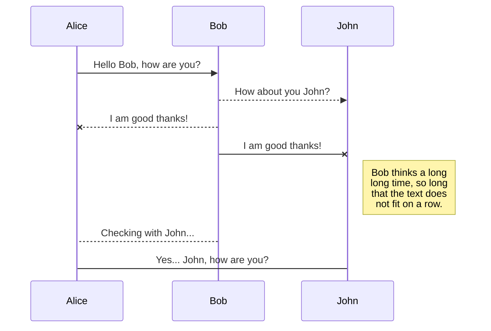
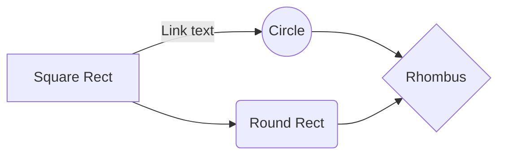

# Setup Guide

This ... will walk you through ... 

Firstly, it is important to 

| Folder         | Content                       |
|----------------|-------------------------------|
|bin| Fabric binaries |
|chaincode| |
| cli-scripts | Set of scripts to be run inside a CLI container, to interact with the network |
|config |Configuration files for peers (core.yaml), orderers (orderer.yaml) and channels (configtx.yaml)|
| fabric-ca | local peer MSP, contains private cryptografic materials |

After deploying the network, X additional folders will be generated on the ...


<details>
<summary>Prerequisites</summary>

  ## 1. Prerequisites

To deploy the network you will need the following technologies:  
1. **Unix-based Operating system** or **WSL2.0** if you are using Windows.
2. **Git** - Check 
3. **Docker** - If you will be using WSL, then don't forget to enable WSL2.0 engine support;
4. **Curl** - Check curl documentation [here](https://curl.se/download.html) or run `sudo apt install curl`
5. **Go Programming Language** - Check Go documentation [here](https://go.dev/dl/) or run:
	  ```
		sudo wget https://go.dev/dl/go1.21.6.linux-amd64.tar.gz	
		sudo tar -C ../../usr/local  -xzf  go1.21.6.linux-amd64.tar.gz
		...
	  ```
  
 This repository must then be cloned to your working directory (if you are using WSL, the directory must be ins the WSL filesystem). 
 Afterwards, you must install Hyperledger Fabric's binaries and Docker image. The install script `install-fabric.sh` is included in this directory. Open a new terminal at *Blockopoly/src* and run the following command:
  	  `chmod +x install-fabric.sh && ./install-fabric.sh docker binary`
</details>

<details>
<summary>Deploy the network</summary>

  ## 2. Deploy the network
Open a terminal at *Blockopoly/src*. 


</details>


> **ProTip:** You can disable any **Markdown extension** in the **File properties** dialog.


## UML diagrams

You can render UML diagrams using [Mermaid](https://mermaidjs.github.io/). For example, this will produce a sequence diagram:



And this will produce a flow chart:

